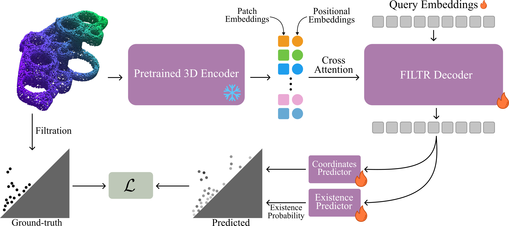

<h1 align="center">FILTR: Extracting Topological Features from Pretrained 3D Models</h1>

<p align="center"><strong>CVPR 2026 (Oral)</strong></p>

<p align="center">
  <a href="https://filtr-topology.github.io/">
    
  </a>
  <a href="https://huggingface.co/datasets/LouisM2001/donut">
    
  </a>
  <a href="https://arxiv.org/abs/2604.22334">
    
  </a>
  <a href="LICENSE">
    
  </a>
</p>

## Overview

FILTR predicts persistence diagrams from pretrained point-cloud encoder features in a feed-forward pass. This repository contains model code, training utilities, CUDA extensions, DONUT dataset helpers, checkpoint download helpers, and preprocessing scripts for feature and diagram generation.

<p align="center">
  
</p>

## Roadmap

Most urgent follow-up work:

- [ ] Publish stable pretrained checkpoints and document exact filenames/checksums ([#5](https://github.com/lmartinez2001/filtr/issues/5))
- [ ] Fix and validate the end-to-end training and validation pipeline ([#14](https://github.com/lmartinez2001/filtr/issues/14))
- [ ] Add feature extraction scripts for Point-MAE, PCP-MAE, PointGPT, point2vec, and other supported backbones ([#13](https://github.com/lmartinez2001/filtr/issues/13))
- [ ] Improve generated artifact storage management for features, diagrams, logs, and checkpoints ([#7](https://github.com/lmartinez2001/filtr/issues/7))
- [ ] Remove tracked compiled artifacts from the repository history/index ([#2](https://github.com/lmartinez2001/filtr/issues/2))

## Recommended Setup: Dev Container

Clone with submodules:

```bash
git clone --recursive https://github.com/lmartinez2001/filtr.git
cd filtr
```

Create host directories for data and checkpoints:

```bash
mkdir -p /path/to/filtr-data
mkdir -p /path/to/filtr-ckpts
```

Edit `.devcontainer/devcontainer.json` and set mounts for your machine:

```json
"mounts": [
  "source=/path/to/filtr-data,target=/workspaces/filtr/data,type=bind,consistency=cached",
  "source=/path/to/filtr-ckpts,target=/workspaces/filtr/ckpts,type=bind,consistency=cached"
]
```

Then run VS Code command:

```text
Dev Containers: Rebuild and Reopen in Container
```

The devcontainer runs `bash extensions/install_extensions.sh` after creation so CUDA extensions are built after GPU access is available.

## Using a Prebuilt Image

Release images include CUDA, Python, PyTorch, Python dependencies, and the repository source under `/workspaces/filtr`. Runtime data, checkpoints, and experiment outputs should still be bind-mounted from the host.

Use this in `.devcontainer/devcontainer.json` instead of the `build` block:

```json
"image": "ghcr.io/lmartinez2001/filtr:latest"
```

Keep the same GPU arguments and mounts:

```json
"runArgs": ["--gpus", "all", "--shm-size=8g"],
"mounts": [
  "source=/path/to/filtr-data,target=/workspaces/filtr/data,type=bind,consistency=cached",
  "source=/path/to/filtr-ckpts,target=/workspaces/filtr/ckpts,type=bind,consistency=cached"
],
"postCreateCommand": "bash extensions/install_extensions.sh"
```

For plain Docker:

```bash
docker run --gpus all -it \
  --shm-size=8g \
  -v /path/to/filtr-data:/workspaces/filtr/data \
  -v /path/to/filtr-ckpts:/workspaces/filtr/ckpts \
  -v /path/to/filtr-experiments:/workspaces/filtr/experiments \
  ghcr.io/lmartinez2001/filtr:latest
```

Inside the container, run CUDA extension installation once before training:

```bash
bash extensions/install_extensions.sh
```

## Download Pretrained Encoders Checkpoints

Inside the container:

```bash
python3 preprocess/download_checkpoints.py ckpts
```

This downloads Point-BERT, Point-MAE, PCP-MAE, and PointGPT checkpoints into `ckpts/`. To skip Google Drive downloads:

```bash
python3 preprocess/download_checkpoints.py ckpts --skip-google-drive
```

## Download DONUT

Log in to Hugging Face before downloading DONUT:

```bash
huggingface-cli login
```

If your environment uses the newer Hugging Face CLI, use:

```bash
hf auth login
```

Then download the dataset:

```bash
python3 preprocess/datasets/get_donut.py data/donut
```

This materializes the DONUT dataset under:

```text
data/donut/pcd
data/donut/obj
```

## Extract Point-BERT Features

Initialize the PointBERT submodule if needed:

```bash
git submodule update --init --recursive third_party/pointbert
```

Extract features:

```bash
python3 preprocess/features_extraction/extract_pointbert_features.py \
  --model_ckpt ckpts/Point-BERT.pth \
  --dvae_ckpt ckpts/dvae.pth \
  --pcd_dir data/donut/pcd \
  --output_dir data/donut/features/pointbert \
  --in_points 1024 \
  --out_points 2048 \
  --seed 0
```

Features are written to:

```text
data/donut/features/pointbert/out_2048/in_1024
```

## Compute Persistence Diagrams

$\alpha$ diagrams:

```bash
python3 preprocess/topology/compute_alpha_diagrams.py \
  --pcd_dir data/donut/pcd \
  --output_dir data/donut/diagrams_alpha \
  --rescale \
  --n_workers 8
```

Rips diagrams:

> [!CAUTION]
> Do not use more than 2 or 3 workers for Rips diagrams computation, as it might overload memory.

```bash
python3 preprocess/topology/compute_rips_diagrams.py \
  --pcd_dir data/donut/pcd \
  --output_dir data/donut/diagrams_rips \
  --max_edge_length 2.0 \
  --max_dimension 2 \
  --n_workers 2
```


## Build Dataset Indices

Generate split manifests:

```bash
python3 preprocess/datasets/create_splits.py \
  --diagram_dir data/donut/diagrams_alpha \
  --pcd_dir data/donut/pcd \
  --tokens_dir data/donut/features/pointbert/out_2048/in_1024 \
  --split_dir data/donut \
  --output_dir data/donut \
  --output_suffix _out2048_in1024_pbert \
  --overwrite
```

This writes config-ready manifests:

```text
data/donut/train_out2048_in1024_pbert.json
data/donut/val_out2048_in1024_pbert.json
```

## Train

Run the default Point-BERT feature model:

```bash
python3 train.py exp_name=donut_pbert
```

Outputs are written to:

```text
experiments/donut_pbert
```

For Rips diagrams, use the Rips dataset config and matching index names:

```bash
python3 train.py exp_name=donut_pbert_rips dataset=donut_rips
```

## Experiment Logging with W&B

FILTR uses the `logger` Hydra config group. The default logger writes no external logs:

```bash
python3 train.py exp_name=donut_pbert logger=default
```

To log to Weights & Biases, first link the container to your W&B account:

```bash
wandb login
```

Paste an API key from:

```text
https://wandb.ai/authorize
```

Then run training with the W&B logger:

```bash
python3 train.py exp_name=donut_pbert logger=wandb logger.project=<your-wandb-project>
```

For example:

```bash
python3 train.py exp_name=donut_pbert logger=wandb logger.project=FILTR
```

If you are running on a remote machine or CI, you can also provide the key through the environment:

```bash
export WANDB_API_KEY=<your-api-key>
python3 train.py exp_name=donut_pbert logger=wandb logger.project=FILTR
```

## Citation

```bibtex
@inproceedings{Martinez2026FILTR,
  title={FILTR: Extracting Topological Features from Pretrained 3D Models},
  author={Louis Martinez and Maks Ovsjanikov},
  booktitle={Proceedings of the IEEE/CVF Conference on Computer Vision and Pattern Recognition (CVPR)},
  year={2026}
}
```
